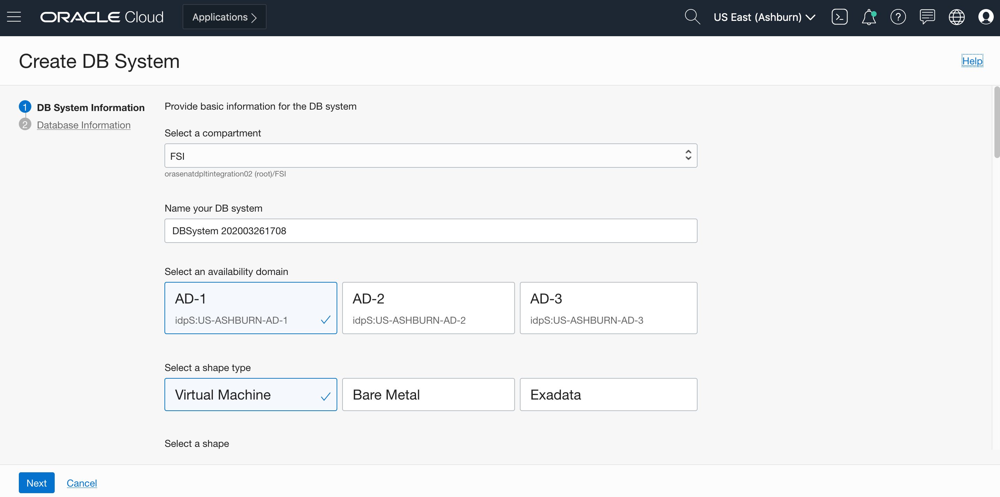
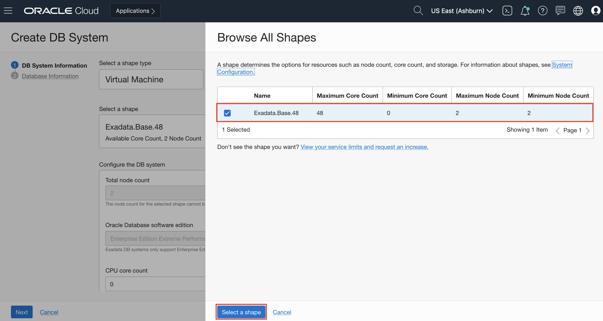
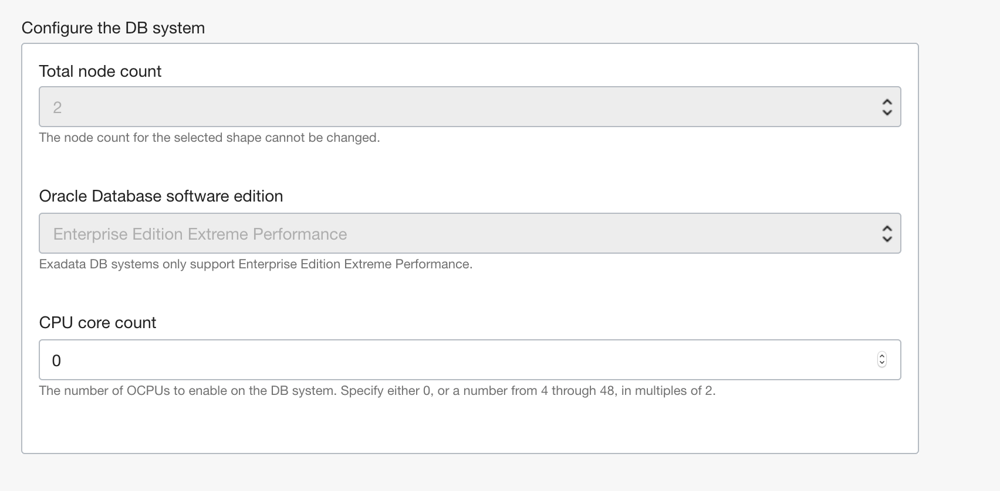
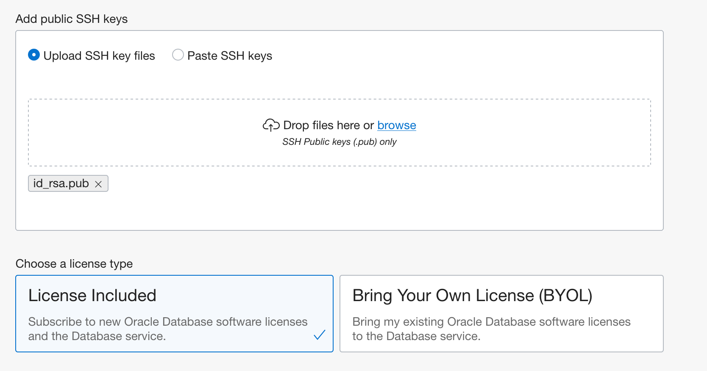
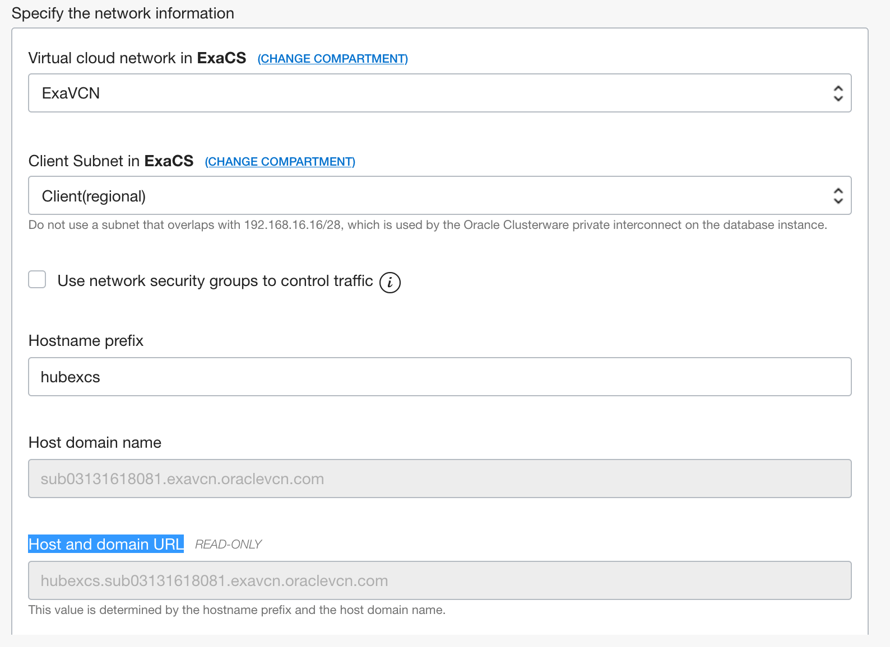
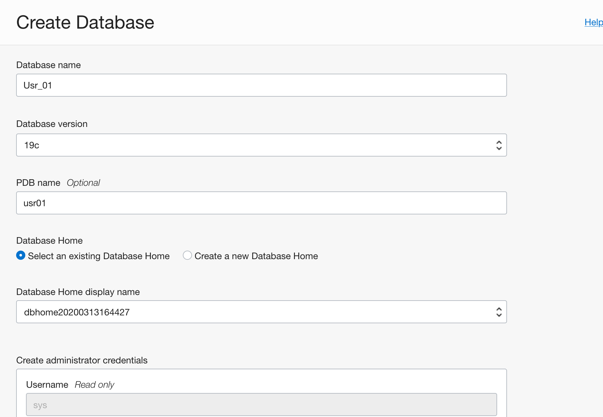

# Provision Exadata Infrastructure

## Introduction

This lab walks you through the steps to get started using the Oracle Exadata Cloud Service Infrastructure. You will provision a new database infrastructure.

### Objectives

As a database user or DBA,

* Rapidly deploy Exadata Infrastructure in a pre-provisioned private network in your OCI account

### Prerequisites

* An Oracle Cloud Infrastructure account with service limits to deploy at least one 1/4 rack of Exadata Infrastructure in any one region or Availability Domain.
* You also need privileges to create Exadata Infrastructure

## **Step 1:** Create an Exadata Cloud Service Infrastructure

1. Login to your OCI account as a database user.

2. Click on the hamburger menu icon on the top left of the screen

    

3. Click on **Bare Metal, VM, and Exadata** from the menu

    

4. Select **ExaCS Compartment**. Note: Oracle Cloud Infrastructure allows logical isolation of users within a tenancy through Compartments. This allows multiple users and business units to share an OCI tenancy while being isolated from each other.

    

5. If you have chosen the compartment you do not have privileges on, such as a root compartment, you will not be able to provision a Database instance in it.

6. More information about Compartments and Policies is provided in the OCI Identity and Access Management documentation [here](https://docs.cloud.oracle.com/iaas/Content/Identity/Tasks/managingcompartments.htm?tocpath=Services%7CIAM%7C_____13).

7. Click on **Create DB System** that is created.

    

8. Upon clicking, a pop-up will appear that will enable you to create exadata infrastructure. Fill in Section 1: DB System Information with the details shown below.

    

    

9. Select a compartment : < Your working compartment >

10. Name your DB system : < DB Display Name >

11. Select an availability domain : < AD1, AD2, AD3 >

    

12. Select a shape type : Exadata

13. You can select required shape from the pop-up based on your availability

    

    

14. Configure the DB system

    a. Total node count : 2

    b. Oracle Database software edition : Enterprise Edition Extreme Performance

    c. CPU core count : < Min 4 upto 48 >

    

15. Configure storage (Optional)

    a. Add public SSH keys : < Add public key >

    b. Choose a license type : < License Included >

    

16. Specify the network information

    a. Virtual cloud network in ExaCS : ExaVCN

    b. Client Subnet in ExaCS : Client(regional)

    c. Hostname prefix : <your hostname prefix>

    d. Host domain name : read-only

    e. Host and domain URL : read-only

    

17. After clicking **Next**, fill in the details for Database Information as shown below

    a. Database name : usrXX

    b. Database version : 19c

    c. PDB Name : usr_XX

    d. Database Home : Select an existing Database Home

    e. Database Home display name : User-XX-db

    f. Create administrator credentials

    g. Password : create password

    h. Select workload type: On-Line Transaction Processing (Choose this), Decision Support System (DSS)

    i. Configure database backups : do not check this </copy>

    

    

18. Password must be 9 to 30 characters and contain at least 2 uppercase, 2 lowercase, 2 special, and 2 numeric characters. The special characters must be _, #, or -.****

20. For this lab, we will be using the following as password

    ```
    <copy> WE#lcome_1234 </copy>
    ```

21. After filling all the required details, click on **Create Database**.

    

22. Your Exadata cloud service database instance should be up and running in a few minutes.

    


All Done! You have successfully deployed your Exadata cloud service infrastructure and created a database instance and it should be ready for use.

You may proceed to the next lab.

## Acknowledgements

- **Author** - Tejus Subrahmanya, Phani Turlapati, Abdul Rafae, Sathis Muniyasamy, Sravya Ganugapati, Padma Natarajan, Aubrey Patsika, Jacob Harless
- **Last Updated By/Date** - Jess Rein - Cloud Engineer, November 2020

## See an issue?
Please submit feedback using this [form](https://apexapps.oracle.com/pls/apex/f?p=133:1:::::P1_FEEDBACK:1). Please include the *workshop name*, *lab* and *step* in your request.  If you don't see the workshop name listed, please enter it manually. If you would like for us to follow up with you, enter your email in the *Feedback Comments* section.
